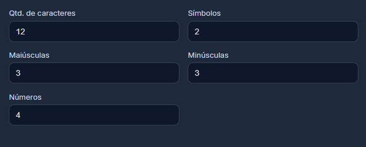

<div align="center">
  <h1>🔐 Gerador de Senha</h1>
  
  <p>
    Gerador de senhas customizável, indicador de força e cópia para a área de transferência.
  </p>
  <p>
    
    
    
  </p>
</div>


## Sumário

- [Visão geral](#visão-geral)
- [Estrutura do projeto](#estrutura-do-projeto)
- [Recursos](#recursos)
- [Como usar (rápido)](#como-usar-rápido)
- [Exemplo](#exemplo)


## Visão geral

Pequeno aplicativo front-end que gera senhas seguindo parâmetros do usuário (total de caracteres, quantidades mínimas de símbolos, maiúsculas, minúsculas e números). Possui:

- botão para ocultar/mostrar (visual) usando `blur`;
- indicador de força da senha (barra e rótulo);
- cópia para clipboard com fallback;
- módulo utilitário (`JavaScript/utils.js`) documentado com JSDoc.


## Estrutura do projeto

src/
├─ Image/
│ ├─ emoji.jpeg
│ ├─ exemplo.1.png
│ ├─ exemplo.2.png
│ ├─ line.gif
│ └─ numeros.png
├─ JavaScript/
│ ├─ utils.js # módulo: gerarSenha, shuffleArray, avaliarForca, copyToClipboard (export)
│ └─ index.js # integrações DOM (import do utils.js)
├─ Styles/
│ └─ style.css
└─ index.html


## Recursos

- Definição personalizada de:
  - total de caracteres;
  - quantidade mínima de símbolos;
  - quantidade mínima de letras maiúsculas;
  - quantidade mínima de letras minúsculas;
  - quantidade mínima de números.
- Ocultar/mostrar senha via **blur** (exibe o valor real, apenas desfocado).
- Indicador de força (barra + texto).
- Cópia para área de transferência com feedback.
- Validação (a soma dos requisitos mínimos não pode ser maior que o total).
- Código modular (`utils.js`) com JSDoc.
- Uso demonstrado dos métodos nativos solicitados: `Math.random`, `slice`, `includes`, `join`, `push`.


## Como usar (rápido)

1. Abra `index.html` no navegador (duplo clique) — ou rode um servidor local (recomendado).
2. Preencha os campos (Qtd. caracteres, Símbolos, Maiúsculas, Minúsculas, Números).
3. Clique **Gerar senha**.
4. Use o botão de ícone para **mostrar/ocultar** (blur) a senha.
5. Clique **Copiar** para copiar a senha.


## Exemplo



- Transcrição:

```
Quantos caracteres deverá ter:
12
Quantos simbolos deverá ter:
2
Quantas letras maiúsculas deverá ter:
3
Quantas letras minúsculas deverá ter:
3
Quantos numeros deverá ter:
4
```

### Imagem de exemplo de saída


- Transcrição:

```
Senha gerada: :_3lh1ZCv2t7
Força da senha: Forte
```


